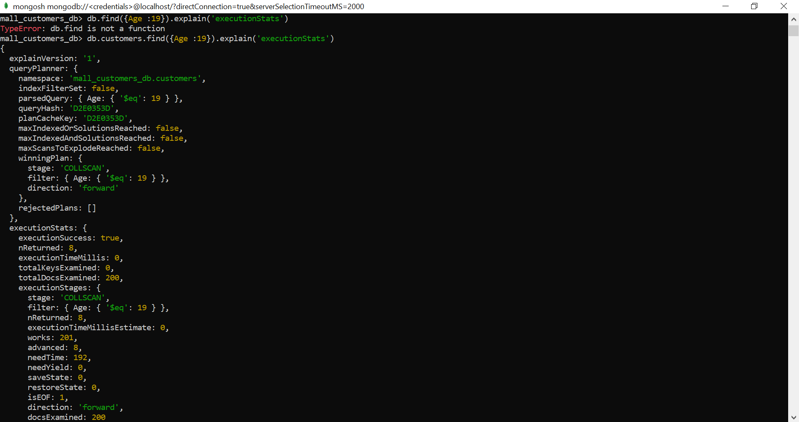
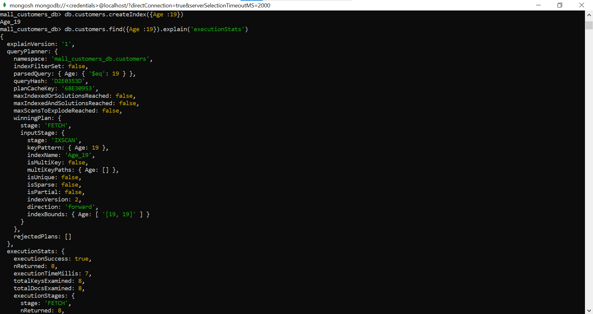
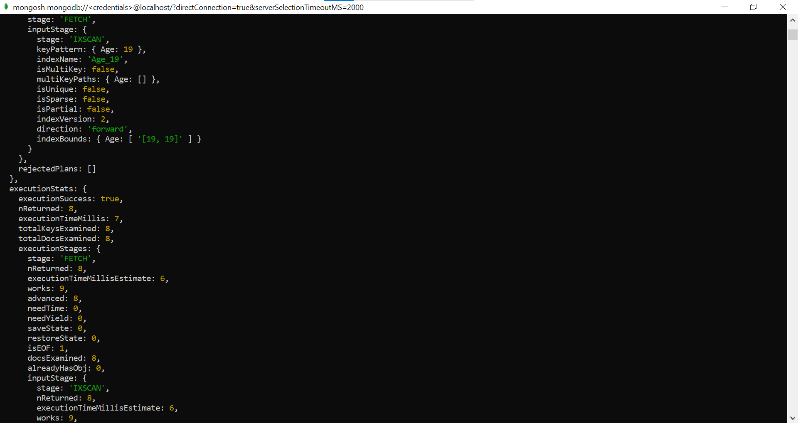

Docker:

Run mongo container:
(docker-compose up -d)

import dataset:

Create:

Read:

Update:

Delete:

Using indexes improves query performance,lets see firstly without index:

then creating index

and the same query takes less time to execute, and less people to examine

