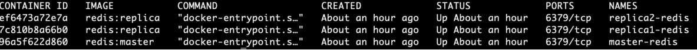
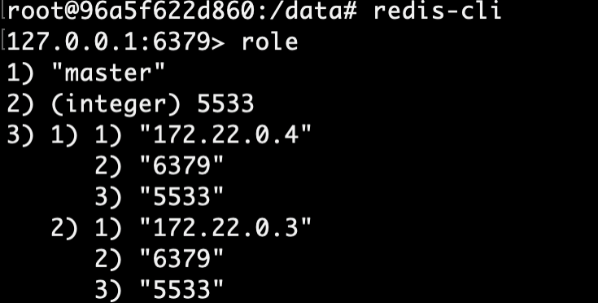

1)Возьмем датасет на 20 мб (data.json)
2)Запустим контейнер с Redis, прокинув порт 6379. (Dockerfile)

3)Используя библиотеку redis и питон, будем переводить наш JSON в различные форматы и закидывать их в контейнер. (main.py)
4)Наш контейнер

5)Для мастер создадим redis_master.config и Dockerfile.master, для реплик redis_replica.conf и dockerfile.replica

6)В итоге наш кластер:

А также мастер и слэйвы:

7)Добавим ключ в мастер и удостоверимся что он появился в реплике:
мастер:

реплика:
