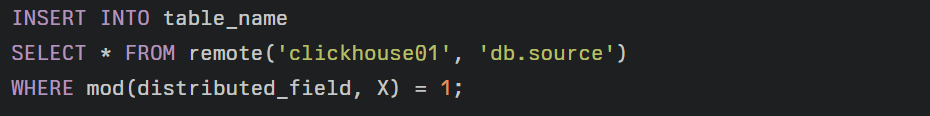

a. История развития СУБД
ClickHouse была разработана компанией Яндекс для обеспечения работы Яндекс.Метрики — второй крупнейшей в мире платформы для веб-аналитики. В 2014 году Яндекс полностью перезапустил свой сервис веб-аналитики Метрика 2.0 на базе ClickHouse, что позволило пользователям строить произвольные отчеты. В 2016 году ClickHouse была переведена из проприетарного решения в open source, и Яндекс опубликовал исходный код СУБД под лицензией Apache 2.0. В 2019 году ClickHouse была включена в состав реестра отечественного программного обеспечения, что позволило использовать ее в проектах цифровизации государственных и частных компаний РФ с учетом требований к 2019 году.

b. Инструменты для взаимодействия с СУБД
ClickHouse поддерживает различные инструменты для взаимодействия, включая:
SQL-интерфейс для выполнения запросов
API для программного доступа к данным
Визуальные инструменты, такие как DBeaver, для работы с базами данных
Плагины и расширения от сторонних разработчиков для расширения функциональности

c. Какой database engine используется в вашей СУБД?
ClickHouse использует Atomic database engine по умолчанию, начиная с версии 20.10. Atomic engine отличается от Ordinary engine способом хранения данных на файловой системе и позволяет решать некоторые проблемы, существовавшие в Ordinary engine.

d. Как устроен язык запросов в вашей СУБД?
ClickHouse использует SQL-диалект, который близок к ANSI SQL. Он поддерживает векторизованное выполнение запросов, что обеспечивает высокую производительность при работе с большими объемами данных.
Примеры запросов
SELECT * FROM table_name ORDER BY timestamp; - Возвращает все строки из таблицы table_name, отсортированные по столбцу timestamp.
SELECT COLUMNS('a') FROM col_names; - Возвращает столбцы из таблицы col_names, которые содержат символ a в их имени.
SELECT * FROM helloworld.my_first_table ORDER BY timestamp FORMAT TabSeparated; - Возвращает все строки из таблицы my_first_table в формате TabSeparated, отсортированные по столбцу timestamp.
SELECT number FROM numbers(20) WHERE (number > 10) AND (number % 3 == 0); - Возвращает числа из таблицы numbers, которые являются кратными 3 и больше 10.
Пример использования CAST:
SELECT uid, name, CAST(gender, 'Int8') FROM user; - Возвращает столбцы uid, name и преобразованный тип gender в Int8 из таблицы user.
ClickHouse поддерживает дополнительные функции, такие как GROUP BY, ORDER BY, subqueries in FROM, JOIN clause, IN operator, window functions and scalar subqueries. Он также поддерживает создание индексов, что может улучшить производительность запросов.

e. Распределение файлов БД по разным носителям?
ClickHouse использует распределение файлов по разным носителям для обеспечения высокой доступности и масштабируемости. Он поддерживает географически распределенные реплики и репликацию данных на различных носителях.

f. На каком языке/ах программирования написана СУБД?
ClickHouse написана на языке C++.

g. Какие типы индексов поддерживаются в БД? Приведите пример создания индексов.
ClickHouse поддерживает вторичные индексы, которые могут быть созданы с помощью SQL-запросов. Например, для создания индекса на столбце name можно использовать запрос CREATE INDEX idx_name ON table_name (name). В ClickHouse (и в других похожих системах) есть только один индекс, по которому данные более-менее упорядочиваются (clustered index), что обеспечивает возможность эффективно читать диапазоны по этому ключу.

h. Как строится процесс выполнения запросов в вашей СУБД?
ClickHouse использует векторизованное выполнение запросов, что обеспечивает высокую производительность при работе с большими объемами данных. Он также поддерживает распределение запросов между различными серверами для обеспечения масштабируемости.

i. Есть ли для вашей СУБД понятие «план запросов»? Если да, объясните, как работает данный этап.
ClickHouse поддерживает понятие «план запросов», который является важной частью процесса выполнения запросов. План запроса определяет, как будет выполнен запрос, и может включать в себя различные операции, такие как фильтрация, группировка и агрегация данных.

j. Поддерживаются ли транзакции в вашей СУБД? Если да, то расскажите о нем. Если нет, то существует ли альтернатива?
ClickHouse не поддерживает транзакции в классическом смысле. Он использует асинхронную репликацию для обеспечения высокой доступности и масштабируемости. Если вам нужна поддержка транзакций, то может потребоваться использование дополнительных инструментов или альтернативных решений.

k. Какие методы восстановления поддерживаются в вашей СУБД. Расскажите о них.
ClickHouse поддерживает создание резервных копий и восстановление из них. Это позволяет обеспечить высокую доступность и масштабируемость при работе с большими объемами данных.

l. Расскажите про шардинг в вашей конкретной СУБД. Какие типы используются? Принцип работы.
Шардирование в ClickHouse является стратегией горизонтального масштабирования кластера, при которой части одной базы данных размещаются на разных шардах. Шард состоит из одного или нескольких хостов-реплик. Запрос на запись или чтение в шард может быть отправлен на любую его реплику, выделенного мастера нет.
Принцип работы
Шардирование позволяет распределить фрагменты данных из одной базы по разным узлам кластера, увеличивая пропускную способность и снижая задержку обработки данных
Шард ClickHouse – это группа копий данных (реплик) для обеспечения отказоустойчивости СУБД, он состоит из одного или нескольких хостов-реплик
Типы шардирования:
В ClickHouse используются различные типы шардирования, такие как:
Распределение данных по полю - данные распределяются по полю, и каждый шард содержит данные, которые относятся к данному полю

Распределение данных по ключу - данные распределяются по ключу, и каждый шард содержит данные, которые относятся к данному ключу

Пример
Для примера рассмотрим, как можно распределить данные по полю distributed_field:

Здесь мы заливаем данные с первого шарда на второй шард, при этом отбираем с первого шарда записи, остаток от деления поля distributed_field на X (количество шардов) равен номеру шарда за вычетом единицы

m. Возможно ли применить термины Data Mining, Data Warehousing и OLAP в вашей СУБД?
Да, ClickHouse может быть использована для Data Mining, Data Warehousing и OLAP. Она поддерживает векторизованное выполнение запросов, что обеспечивает высокую производительность при работе с большими объемами данных.

n. Какие методы защиты поддерживаются вашей СУБД? Шифрование трафика, модели авторизации и т.п.

Шифрование трафика
ClickHouse поддерживает шифрование трафика с использованием TLS. Для включения TLS можно отредактировать файл /etc/clickhouse-server/config.d/remote_servers.xml в случае с ClickHouse 20.10 или более поздней версии.

Модели авторизации
ClickHouse поддерживает модели авторизации, которые определяют, какие пользователи могут выполнять какие действия с данными. Например, можно определить, какие пользователи могут выполнять запросы, а какие только просматривать данные.

Для создания пользователя и назначения ему прав можно использовать следующий SQL-запрос:
CREATE USER user1 WITH PASSWORD = 'password';
GRANT SELECT ON * TO user1;

Также можно использовать XML-файлы для настройки пользователей и их прав. Например, для создания пользователя и назначения ему прав можно использовать следующий XML-файл:
<users>
  <user>
    <name>user1</name>
    <password>password</password>
    <grants>
      <grant>
        <database>.*</database>
        <privilege>SELECT</privilege>
      </grant>
    </grants>
  </user>
</users>

o. Какие сообщества развивают данную СУБД? Кто в проекте имеет права на коммит и создание дистрибутива версий? Расскажите об этих людей и/или компаниях.
Яндекс является основным разработчиком ClickHouse, но также есть другие компании и индивидуальные разработчики, которые принимают участие в разработке и поддержке проекта.

p. Создайте свои собственные данные для демонстрации работы СУБД.
Возьмем данные кулинарных рецептов: https://recipenlg.cs.put.poznan.pl/dataset.

Создадим таблицу:
CREATE TABLE recipes
(
    title String,
    ingredients Array(String),
    directions Array(String),
    link String,
    source LowCardinality(String),
    NER Array(String)
) ENGINE = MergeTree ORDER BY title;
Добавим данные:
clickhouse-client --query "
    INSERT INTO recipes
    SELECT
        title,
        JSONExtract(ingredients, 'Array(String)'),
        JSONExtract(directions, 'Array(String)'),
        link,
        source,
        JSONExtract(NER, 'Array(String)')
    FROM input('num UInt32, title String, ingredients String, directions String, link String, source LowCardinality(String), NER String')
    FORMAT CSVWithNames
" --input_format_with_names_use_header 0 --format_csv_allow_single_quote 0 --input_format_allow_errors_num 10 < full_dataset.csv
 проверим данные:
 SELECT count() FROM recipes;
 вывод:
┌─count()─┐\
│ 2231141 │\
└─────────┘\
Найдем например самые упоминаемые ингридиенты в рецептах:
SELECT \
    arrayJoin(NER) AS k, \
    count() AS c \
FROM recipes \
GROUP BY k \
ORDER BY c DESC \
LIMIT 50 \
вывод:
┌─k────────────────────┬──────c─┐
│ salt                 │ 890741 │
│ sugar                │ 620027 │
│ butter               │ 493823 │
│ flour                │ 466110 │
│ eggs                 │ 401276 │
│ onion                │ 372469 │
│ garlic               │ 358364 │
│ milk                 │ 346769 │
│ water                │ 326092 │
│ vanilla              │ 270381 │
│ olive oil            │ 197877 │
│ pepper               │ 179305 │
│ brown sugar          │ 174447 │
│ tomatoes             │ 163933 │
│ egg                  │ 160507 │
│ baking powder        │ 148277 │
│ lemon juice          │ 146414 │
│ Salt                 │ 122557 │
│ cinnamon             │ 117927 │
│ sour cream           │ 116682 │
│ cream cheese         │ 114423 │
│ margarine            │ 112742 │
│ celery               │ 112676 │
│ baking soda          │ 110690 │
│ parsley              │ 102151 │
│ chicken              │ 101505 │
│ onions               │  98903 │
│ vegetable oil        │  91395 │
│ oil                  │  85600 │
│ mayonnaise           │  84822 │
│ pecans               │  79741 │
│ nuts                 │  78471 │
│ potatoes             │  75820 │
│ carrots              │  75458 │
│ pineapple            │  74345 │
│ soy sauce            │  70355 │
│ black pepper         │  69064 │
│ thyme                │  68429 │
│ mustard              │  65948 │
│ chicken broth        │  65112 │
│ bacon                │  64956 │
│ honey                │  64626 │
│ oregano              │  64077 │
│ ground beef          │  64068 │
│ unsalted butter      │  63848 │
│ mushrooms            │  61465 │
│ Worcestershire sauce │  59328 │
│ cornstarch           │  58476 │
│ green pepper         │  58388 │
│ Cheddar cheese       │  58354 │
└──────────────────────┴────────┘

50 rows in set. Elapsed: 0.112 sec. Processed 2.23 million rows, 361.57 MB (19.99 million rows/s., 3.24 GB/s.)

Самые сложные рецепты с клубникой:
SELECT
    title,
    length(NER),
    length(directions)
FROM recipes
WHERE has(NER, 'strawberry')
ORDER BY length(directions) DESC
LIMIT 10;

вывод:
┌─title────────────────────────────────────────────────────────────┬─length(NER)─┬─length(directions)─┐
│ Chocolate-Strawberry-Orange Wedding Cake                         │          24 │                126 │
│ Strawberry Cream Cheese Crumble Tart                             │          19 │                 47 │
│ Charlotte-Style Ice Cream                                        │          11 │                 45 │
│ Sinfully Good a Million Layers Chocolate Layer Cake, With Strawb │          31 │                 45 │
│ Sweetened Berries With Elderflower Sherbet                       │          24 │                 44 │
│ Chocolate-Strawberry Mousse Cake                                 │          15 │                 42 │
│ Rhubarb Charlotte with Strawberries and Rum                      │          20 │                 42 │
│ Chef Joey's Strawberry Vanilla Tart                              │           7 │                 37 │
│ Old-Fashioned Ice Cream Sundae Cake                              │          17 │                 37 │
│ Watermelon Cake                                                  │          16 │                 36 │
└──────────────────────────────────────────────────────────────────┴─────────────┴────────────────────┘

10 rows in set. Elapsed: 0.215 sec. Processed 2.23 million rows, 1.48 GB (10.35 million rows/s., 6.86 GB/s.)

q. Как продолжить самостоятельное изучение языка запросов с помощью демобазы. Если демобазы нет, то создайте ее.
Для продолжения самостоятельного изучения языка запросов с помощью ClickHouse можно использовать руководства и документацию, предоставляемые на официальном сайте ClickHouse. https://clickhouse.com/docs/ru

r. Где найти документацию и пройти обучение
На официальном сайте в разделе docs https://clickhouse.com/docs/ru

s. Как быть в курсе происходящего
Чтобы быть в курсе происходящего с ClickHouse, можно подписаться на официальный блог и новостную ленту, а также следить за сообществом разработчиков на различных форумах и платформах.